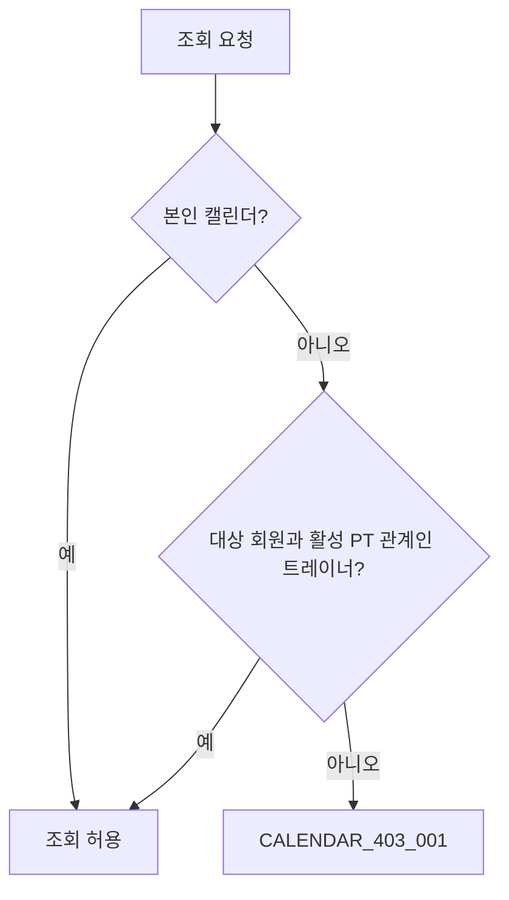

# 🗓️ Calendar Query Flow

> PT 예약과 운동 일지를 결합하는 일별·월별 조회 흐름입니다.

## 접근 제어

## 일별 조회

`CalendarService`가 특정 날짜의 PT 예약을 `CalendarPtReservationPort`에서, 운동 일지와 세트를 `WorkoutDiaryPort`에서 조회해 `CalendarDayResult`로 결합합니다.

## 월별 조회

`CalendarMonthReader`는 해당 월의 시작일 이상, 다음 달 시작일 미만 범위로 PT 날짜와 일지 요약을 조회합니다. 날짜별 누산기에 PT 존재 여부와 일지 요약을 합치고 날짜순으로 반환합니다.

월별 결과는 `calendarMonth` 캐시에 `userId + year + month` 키로 저장됩니다. 운동 일지 쓰기와 운동 종목 스냅샷 변경은 관련 캐시를 커밋 후 무효화해야 합니다.

## 연동 계약

- `CalendarPtReservationPort`: PT 예약 날짜·제목 조회와 트레이너 접근 관계 확인
- `CalendarExercisePort`: 일지 작성 시 유효한 운동 종목 스냅샷 제공
- `WorkoutDiaryPort`: 날짜/기간별 일지와 요약 제공
- `CalendarCacheEvictionPort`: 변경된 월 단위 캐시 제거

