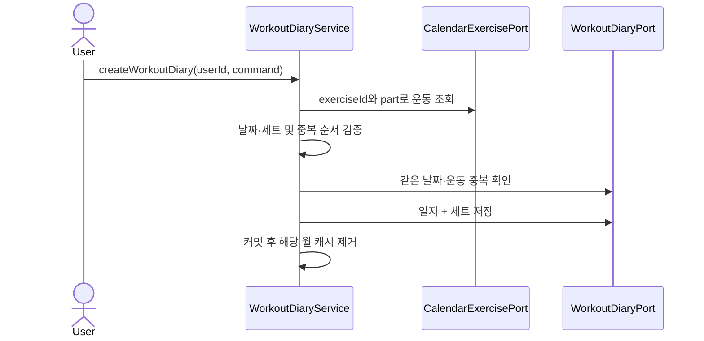

# 🏋️ Workout Diary API Flow

> 운동 일지 등록·수정·삭제의 내부 흐름입니다.

## 책임

`CalendarController`가 인증 ID와 요청을 Command로 변환하고, `WorkoutDiaryService`가 소유권·운동 종목·중복·세트 규칙을 검증합니다. `WorkoutDiaryPort`가 일지와 세트를 저장하며 `CalendarExercisePort`에서 운동 종목 스냅샷을 얻습니다.

## 등록 흐름

일지에는 운동 ID뿐 아니라 작성 당시 운동 이름도 저장됩니다. 따라서 운동 카탈로그 이름이 바뀌어도 기존 기록을 표현할 수 있습니다.

## 수정·삭제

- 수정은 `userId + workoutDiaryId`로 소유 일지를 조회합니다.
- 새 운동 종목을 검증하고 일지 기본 정보와 세트 전체를 교체합니다.
- 삭제도 소유자 조건을 포함해 타인의 일지를 숨겨진 `404`로 처리합니다.
- 수정·삭제 전 기존 일지 날짜를 얻어 그 날짜가 속한 월 캐시만 커밋 후 제거합니다.

## 도메인 규칙

- 세트는 최소 1개입니다.
- `setOrder`는 1 이상이며 한 일지 안에서 유일합니다.
- 무게는 0 이상, 횟수는 1 이상입니다.
- 일지 작성 날짜는 수정 API에서 변경하지 않습니다.

