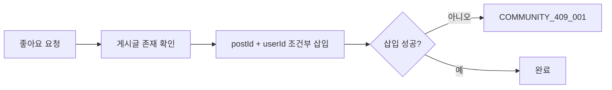

# 👍 Community Interaction & Retention Flow

## 댓글

댓글 작성 시 대상 게시글의 존재를 먼저 확인합니다. 수정·삭제 시 댓글과 부모 게시글을 확인한 뒤 댓글 작성자만 처리할 수 있습니다. 댓글 삭제도 soft delete입니다.

## 좋아요

좋아요 취소는 `postId + userId`로 삭제하고 삭제 행이 없으면 `COMMUNITY_404_003`을 반환합니다. 조건부 삽입/삭제로 중복 요청의 결과를 명확히 합니다.

## 신고 연동

`CommunityCommentReportAdapter`는 신고 도메인이 댓글을 조회·블라인드할 수 있는 경계를 제공합니다. 게시글과 댓글은 신고 대상이므로 soft delete/블라인드 상태를 일반 조회에서 제외하는 정책과 함께 유지해야 합니다.

## 보존 기간 정리

삭제된 게시글과 댓글은 기본 90일 보존 후 `CommunityRetentionJob`이 배치당 최대 500건을 물리 삭제합니다.

1. 만료된 독립 댓글을 먼저 삭제합니다.
2. 만료 게시글의 조회 기록, 좋아요, 댓글을 순서대로 삭제합니다.
3. 마지막으로 게시글을 삭제해 참조 무결성을 지킵니다.

보존 기간과 배치 크기는 `CommunityRetentionProperties`가 관리합니다.

