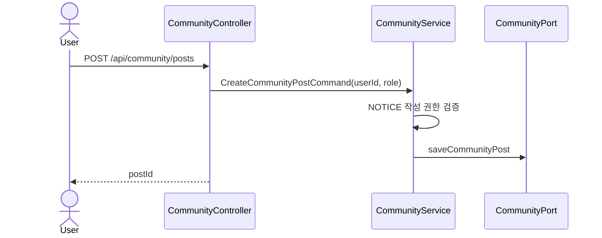
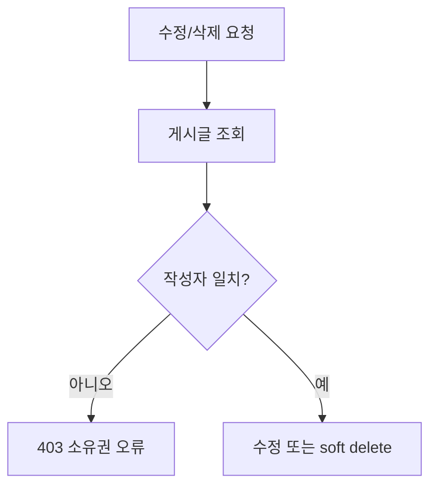

# 📝 Community Post API Flow

## 게시글 작성

인증 역할은 클라이언트 요청이 아니라 `AuthUser`에서 전달됩니다. 자유글은 허용된 모든 역할이 쓸 수 있지만 공지는 ADMIN만 작성합니다.

## 목록·상세 조회

- 전체/내 목록은 유형과 정규화한 제목 검색어를 조건으로 Spring `Page`를 반환합니다.
- 상세 조회 전 활성 게시글 존재를 검증합니다.
- 사용자별 게시글 조회 기록을 `saveViewIfAbsent`로 저장하며 첫 조회일 때만 조회수를 증가시킵니다.
- 상세 결과에는 게시글 정보와 `commentCursorId`, `commentSize` 기준의 댓글 구간이 포함됩니다.

## 수정·삭제

게시글을 ID로 조회한 뒤 도메인 모델의 `isOwner(userId)`로 작성자를 확인합니다. 수정은 제목·내용을 교체하고, 삭제는 soft delete 처리합니다. 삭제된 글은 일반 조회와 상호작용 대상에서 제외됩니다.

