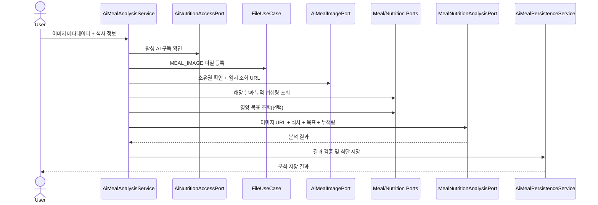

# 🤖 AI Meal Analysis Flow

## 전체 흐름

## 접근 및 파일 정책

- 구독 검증을 가장 먼저 수행해 미구독자의 파일 레코드가 생기지 않게 합니다.
- 프론트가 S3 업로드를 마친 뒤 전달한 메타데이터를 파일 도메인에 `MEAL_IMAGE`로 등록합니다.
- 등록된 파일의 소유자와 유형을 다시 확인하고 AI 서버가 읽을 수 있는 임시 URL을 만듭니다.

## 분석 컨텍스트

AI에는 이미지뿐 아니라 식사 유형·시각, 같은 날 이미 저장된 영양 섭취 합계와 사용자의 영양 목표가 전달됩니다. 목표가 없어도 분석은 진행하고 목표 대비 평가는 생략될 수 있습니다.

## 결과 검증과 저장

`AiMealPersistenceService`가 메뉴, 열량, 매크로 영양값, 평가, 신뢰도와 경고를 검증합니다. 신뢰도는 허용 범위 안이어야 하며 유효한 결과만 `MealAnalysis`로 저장합니다. 외부 AI 호출 실패·응답 오류는 `AiMealAnalysisException` 계열로 변환됩니다.

AI 호출은 현재 요청 흐름에서 동기적으로 완료된 뒤 저장됩니다. 따라서 타임아웃, 재시도, 외부 성공 후 DB 실패 시의 정합성을 함께 고려해야 합니다.

