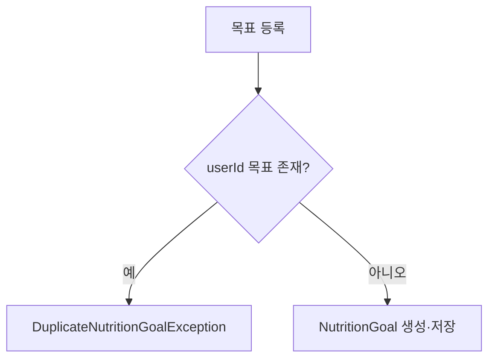
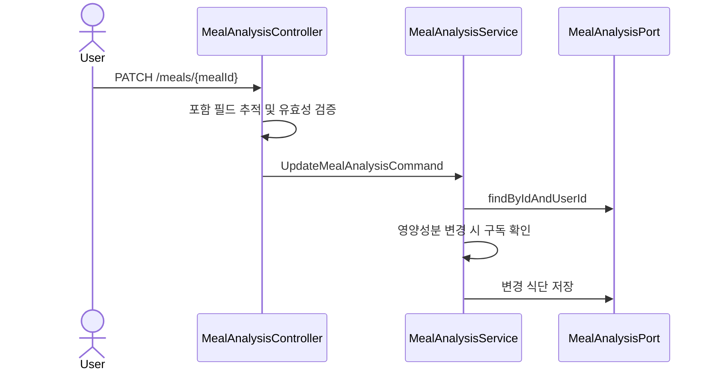

# 🥗 Diet API Flow

> 영양 목표와 수동 식단 CRUD의 내부 흐름입니다. AI 분석은 [AI_MEAL_ANALYSIS_FLOW.md](AI_MEAL_ANALYSIS_FLOW.md)를 참고합니다.

## 영양 목표

`NutritionGoalService`는 사용자별 단일 목표를 보장합니다. 조회·수정·삭제는 인증 사용자 ID로만 수행하며, 수정은 JSON에 실제로 포함된 필드만 반영합니다. 빈 수정 요청이나 명시적 `null`은 `InvalidNutritionGoalUpdateException`으로 거절합니다.

## 수동 식단 등록

1. Controller가 한국어 식사 유형을 `MealType`으로 변환하고 메뉴 공백을 정리합니다.
2. 탄수화물·단백질·지방 중 하나라도 입력되면 `AiNutritionAccessPort`로 현재 활성 구독을 확인합니다.
3. `MealAnalysis`를 생성해 저장하고 전체 응답을 반환합니다.

칼로리만 입력하는 기존 무료 식단 등록은 허용되며, 매크로 영양성분에만 AI 구독 정책이 적용됩니다.

## 소유권과 부분 수정

부분 수정 DTO는 각 필드의 존재 여부와 값을 별도로 추적해 “미전달”과 “명시적 null”을 구분합니다. 식사 유형·시간·메뉴는 null로 제거할 수 없고, 선택 영양값과 파일 ID의 제거 정책은 구독 권한 검증을 거칩니다.

## 조회·삭제

- 단건 조회는 `mealId + userId`로 찾습니다.
- 목록은 본인의 식단만 식사 일시 최신순으로 페이지 조회합니다.
- 삭제도 동일한 소유자 조건으로 실행하고 삭제 행이 0이면 not found 처리합니다.

이 방식은 타인의 식단 ID를 입력해도 존재 여부가 구분되지 않게 합니다.

