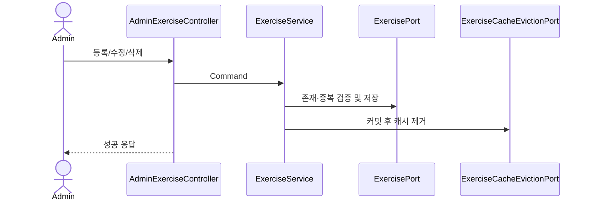

# 🏃 Exercise API Flow

## 쓰기 흐름

- 등록은 이름을 trim한 후 `part + exerciseName` 중복을 검사합니다.
- 수정은 ID 존재 여부를 먼저 확인하고 같은 부위의 다른 종목과 이름이 겹치는지 검사합니다.
- 삭제는 종목을 조회한 뒤 제거합니다.
- 목록 캐시는 모든 쓰기에서 제거되고, 수정·삭제는 Calendar가 사용하는 운동 스냅샷 캐시도 제거합니다.

## 조회 흐름

`part`, `keyword`의 조합에 따라 전체, 검색어, 부위, 부위+검색어 조회 Port를 선택합니다. 결과는 `exerciseList` 캐시에 정규화된 키로 저장되며 `sync = true`로 같은 키의 동시 로딩을 줄입니다.

