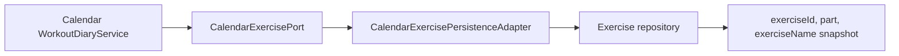

# 🔗 Exercise Integration Flow

## Calendar 연동

Exercise 도메인은 `CalendarExercisePersistenceAdapter`를 통해 Calendar의 `CalendarExercisePort`를 구현합니다. 운동 일지 작성 시 Calendar가 운동 ID와 부위에 맞는 운동을 조회하고 이름 스냅샷을 일지에 저장합니다.

## 변경 영향

- 이름 수정 후 새 일지는 새 이름을 사용하지만 기존 일지는 저장된 스냅샷을 유지합니다.
- 삭제된 종목으로 새 일지를 만들 수 없습니다.
- 수정·삭제 후 `exerciseSnapshots` 캐시를 제거해 Calendar가 오래된 운동 정보를 사용하지 않게 합니다.
- 부위는 수정 API에서 바꿀 수 없으므로 기존 일지와 카탈로그의 부위 정합성을 유지합니다.

