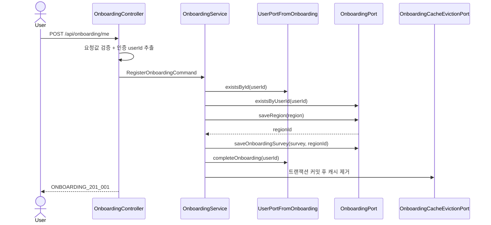
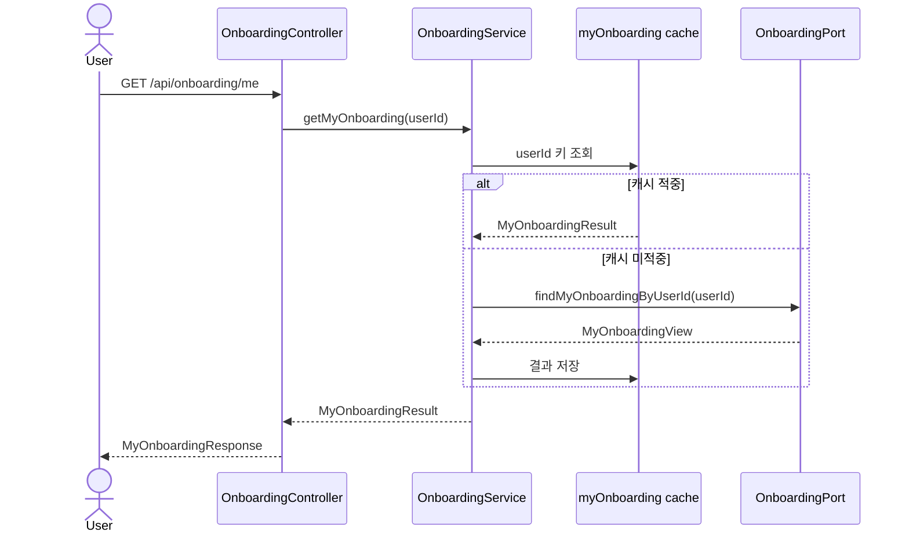
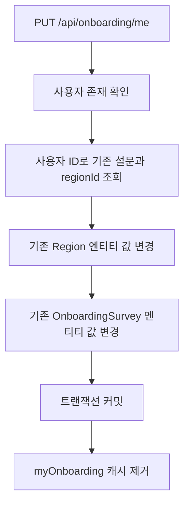

# 🏁 Onboarding API Flow

> `POST`, `GET`, `PUT /api/onboarding/me`의 내부 처리 흐름을 설명합니다.  
> 저장 구조와 User·캐시 연동은 [ONBOARDING_DATA_FLOW.md](ONBOARDING_DATA_FLOW.md)를 참고합니다.

## 1. 책임 범위

| 구성요소 | 책임 |
| --- | --- |
| `OnboardingController` | 인증 사용자 ID 추출, 요청 검증, Command·Response 변환 |
| `OnboardingService` | 등록 중복 검사, 조회, 수정과 트랜잭션 조정 |
| `OnboardingPort` | 설문·지역 저장, 수정 및 조인 조회 |
| `UserPortFromOnboarding` | 사용자 존재 확인과 온보딩 완료 상태 변경 |
| `OnboardingCacheEvictionPort` | 커밋 후 사용자별 온보딩 조회 캐시 제거 |
| `OnboardingSurvey` | 운동 설문과 선호 지역 ID를 담는 도메인 모델 |
| `Region` | 주소 계층과 좌표를 담는 도메인 모델 |

## 2. 온보딩 등록 흐름

처리 순서:

1. 인증 사용자 존재 여부를 확인합니다.
2. 사용자 ID로 기존 설문이 있는지 확인해 중복 등록을 막습니다.
3. `Region`을 먼저 저장하여 `regionId`를 얻습니다.
4. 해당 ID를 참조하는 `OnboardingSurvey`를 저장합니다.
5. User 도메인의 `onboardingCompleted`를 완료 상태로 변경합니다.
6. 트랜잭션이 성공적으로 커밋된 뒤 `myOnboarding` 캐시를 제거합니다.

등록 과정은 하나의 트랜잭션이므로 중간 저장이나 사용자 상태 변경에서 예외가 발생하면 전체 작업이 롤백됩니다.

## 3. 내 온보딩 조회 흐름

- 읽기 전용 트랜잭션을 사용합니다.
- `myOnboarding` 캐시의 키는 `userId`입니다.
- `sync = true`로 같은 키의 동시 캐시 미스에서 중복 조회를 줄입니다.
- 설문과 지역을 한 번에 조회한 `MyOnboardingView`를 결과 DTO로 변환합니다.

## 4. 온보딩 수정 흐름

수정은 새 설문이나 새 지역을 추가하지 않습니다. 기존 설문이 참조하는 `regionId`를 유지하면서 지역 엔티티와 설문 엔티티를 갱신합니다. JPA dirty checking으로 변경사항이 반영됩니다.

## 5. 예외 흐름

| 상황 | 예외 코드 |
| --- | --- |
| 등록·수정 대상 사용자가 없음 | `USER_404` |
| 이미 설문이 있는데 다시 등록 | `USER_409_004` |
| 조회·수정할 설문이 없음 | `ONBOARDING_404` |
| 설문이 참조하는 지역이 없음 | `REGION_404` |
| Bean Validation 실패 | 공통 `400 Bad Request` |

## 6. 핵심 정책

- 한 사용자에게 온보딩 설문은 하나만 존재합니다.
- 사용자 ID는 클라이언트가 지정하지 않고 인증 정보에서 가져옵니다.
- 등록 시에만 User 도메인의 온보딩 완료 상태를 변경합니다.
- 수정은 전체 교체 방식이며 모든 입력 필드가 필수입니다.
- 캐시는 DB 커밋 이후에 제거해 롤백된 데이터를 기준으로 캐시가 무효화되는 상황을 피합니다.

## 문서 정보

- 업데이트일: `2026-07-21`
- 현재 `OnboardingService` 처리 흐름을 기준으로 작성했습니다.

