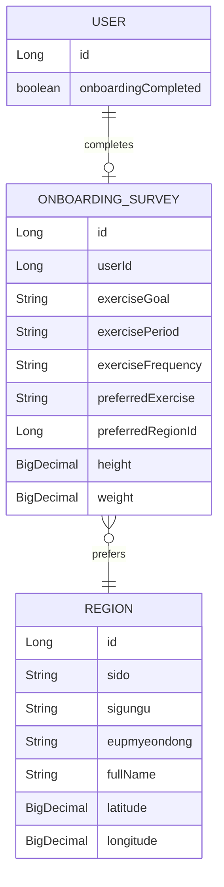
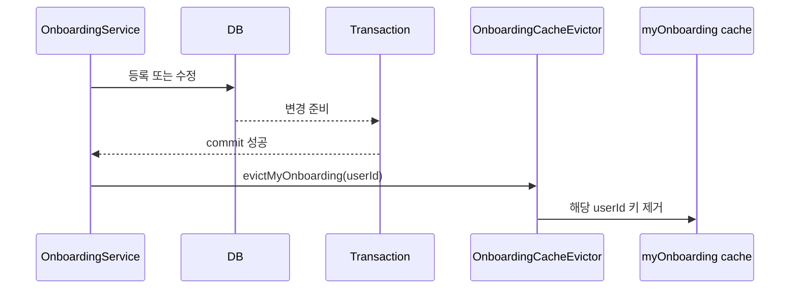

# 🗂️ Onboarding Data & Integration Flow

> 온보딩 설문·지역 데이터 구조와 User 도메인 및 캐시 연동 계약을 설명합니다.  
> HTTP API 처리 순서는 [ONBOARDING_API_FLOW.md](ONBOARDING_API_FLOW.md)를 참고합니다.

## 1. 데이터 관계



`OnboardingSurvey`는 사용자 엔티티를 직접 참조하지 않고 `userId`를 보관합니다. 선호 지역은 `preferredRegionId`를 통해 별도 `Region` 엔티티와 연결됩니다.

## 2. 도메인 모델의 책임

### OnboardingSurvey

- 운동 목적, 기간, 빈도, 선호 운동을 보관합니다.
- 키와 몸무게를 `BigDecimal`로 보관합니다.
- 설문 소유자의 `userId`와 선호 지역의 `preferredRegionId`를 필수값으로 요구합니다.
- HTTP 계층에서는 문자열 공백 여부와 키·몸무게 양수 조건을 먼저 검증합니다.

### Region

- `sido`, `sigungu`, `eupmyeondong`, `fullName`으로 주소 표현을 보관합니다.
- 위도와 경도를 `BigDecimal`로 보관합니다.
- 현재 등록 로직은 동일 주소·좌표의 기존 지역을 재사용하지 않고 사용자 온보딩용 지역을 새로 저장합니다.

## 3. 저장과 조회 모델

등록 시 저장 순서는 다음과 같습니다.

```text
Region 저장
  → 생성된 regionId 획득
  → OnboardingSurvey.preferredRegionId에 연결
  → OnboardingSurvey 저장
  → User.onboardingCompleted 변경
```

조회 시에는 `OnboardingSurveyJpaRepository.findMyOnboardingByUserId`의 JPQL 생성자 조회를 사용합니다. 설문과 지역을 조인해 필요한 필드만 `MyOnboardingView`로 반환하므로 웹 계층이 JPA 엔티티에 의존하지 않습니다.

## 4. 수정 정책

| 데이터 | 수정 방식 |
| --- | --- |
| 설문 | `userId`로 기존 엔티티를 찾아 모든 설문 필드 갱신 |
| 지역 | 기존 설문의 `regionId`로 엔티티를 찾아 주소·좌표 갱신 |
| 사용자 | 이미 완료 상태이므로 수정 API에서는 변경하지 않음 |

지역 ID가 유지되므로 다른 데이터가 해당 지역 행을 공유하도록 확장할 경우 수정 영향 범위를 먼저 검토해야 합니다. 현재 등록 흐름은 사용자별 새 지역 행을 생성하는 구조입니다.

## 5. User 도메인 연동 계약

온보딩 도메인은 User 영속 구현을 직접 호출하지 않고 `UserPortFromOnboarding`에 의존합니다.

```java
public interface UserPortFromOnboarding {
    boolean existsById(Long userId);
    void completeOnboarding(Long userId);
}
```

실제 구현은 User 도메인의 `UserAdapterFromOnboarding`이 담당합니다.

- `existsById`는 설문 저장 전에 사용자 존재를 보장합니다.
- `completeOnboarding`은 User 엔티티의 온보딩 완료 값을 변경합니다.
- 온보딩 서비스의 트랜잭션 안에서 실행되어 설문 저장과 사용자 완료 상태가 함께 성공하거나 롤백됩니다.

## 6. 캐시 일관성



- 조회 캐시 이름은 `myOnboarding`, 키는 사용자 ID입니다.
- 등록·수정 시 `TransactionSynchronization.afterCommit()`을 사용해 커밋 성공 뒤에만 캐시를 제거합니다.
- 활성 트랜잭션 동기화가 없는 호출 환경에서는 즉시 캐시를 제거합니다.
- 다음 조회는 DB의 최신 설문과 지역 정보를 읽어 캐시를 다시 채웁니다.

## 7. 확장 체크포인트

1. 설문 항목을 추가하면 Request, Command, 도메인 모델, JPA 엔티티, `MyOnboardingView`, Result와 Response를 함께 변경해야 합니다.
2. 지역을 공용 마스터 데이터로 전환하면 현재의 사용자별 생성·기존 행 직접 수정 정책을 재설계해야 합니다.
3. 온보딩 삭제나 재등록을 추가하면 User 도메인의 `onboardingCompleted` 되돌리기 정책이 필요합니다.
4. 조회 쿼리 필드를 변경하면 JPQL 생성자 인자의 순서와 `MyOnboardingView` 선언 순서를 일치시켜야 합니다.
5. 쓰기 API를 추가하면 트랜잭션 커밋 후 `myOnboarding` 캐시 무효화를 함께 적용해야 합니다.

## 문서 정보

- 업데이트일: `2026-07-21`
- 현재 영속 Adapter, User Port와 캐시 구현을 기준으로 작성했습니다.

