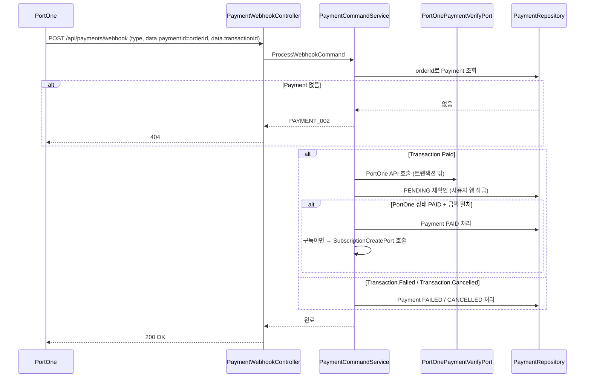

# 💳 결제 API Flow

> 이 문서는 결제 생성·웹훅 처리·조회 API의 내부 흐름을 설명합니다.
> 구독 생성 흐름은 웹훅 처리 단계에서 다루며, 구독 조회 API는 [subscription/docs/API_FLOW.md](../../subscription/docs/API_FLOW.md)를 참고합니다.

---

## 1. PaymentCommandService가 담당하는 역할

| 구성요소 | 책임 |
| --- | --- |
| `PaymentController` | 요청값 검증, 인증 사용자 ID 추출, Command 전달 |
| `PaymentWebhookController` | PortOne 웹훅 수신, `ProcessWebhookCommand` 전달 |
| `PaymentCommandService` | 결제 생성, 중복 검증, 웹훅 처리, PortOne API 검증, 구독 생성 연동 |
| `PaymentQueryService` | 결제 내역 목록 조회, PT 구매 상태 조회 |
| `PtCoursePaymentQueryPort` | pt bc에서 PT 강습 가격 조회 |
| `PortOnePaymentVerifyPort` | PortOne V2 결제 조회 API 호출 |
| `SubscriptionCreatePort` | payments/subscription bc에 구독 생성 요청 |

---

## 2. PT 결제 생성 흐름

```text
사용자
  → POST /api/payments/pt
  → PaymentController
  → CreatePtPaymentCommand
  → PaymentCommandService
      1. PAID 상태 중복 결제 검증 (PAYMENT_001)
      2. PtCoursePaymentQueryPort로 PT 강습 가격 조회
      3. TSID 기반 orderId 생성 ("PT-" 접두사)
      4. PENDING 상태 Payment 저장
  → CreatePtPaymentResponse(orderId, amount)
  → 프론트엔드가 orderId/amount로 PortOne V2 SDK 호출
```

---

## 3. 구독 결제 생성 흐름

```text
사용자
  → POST /api/payments/subscriptions
  → PaymentController
  → CreateSubscriptionPaymentCommand
  → PaymentCommandService
      1. 사용자 행 잠금 (동시 요청 직렬화)
      2. 30분 이상 경과한 PENDING 구독 결제 자동 FAILED 처리
      3. ACTIVE 구독 또는 PENDING 구독 결제 중복 검증 (PAYMENT_004)
      4. 플랜 타입으로 금액 확정 (도메인 계산)
      5. TSID 기반 orderId 생성 ("SUB-" 접두사)
      6. PENDING 상태 Payment 저장
  → CreateSubscriptionPaymentResponse(orderId, amount)
  → 프론트엔드가 orderId/amount로 PortOne V2 SDK 호출
```

---

## 4. 웹훅 처리 흐름

PortOne이 결제 이벤트 발생 시 서버 웹훅 URL로 POST 요청을 전송합니다. 서버가 200을 반환하지 않으면 PortOne이 웹훅을 재전송합니다.



### 단계별 설명

1. 지원하지 않는 이벤트 타입(`Transaction.Paid` / `Transaction.Failed` / `Transaction.Cancelled` 외)이면 즉시 무시합니다.
2. `orderId`로 내부 Payment를 조회합니다. 없으면 404를 반환합니다.
3. `Transaction.Paid` 처리 시 이미 `PENDING`이 아니면 중복 웹훅으로 판단하고 종료합니다.
4. PortOne API 호출은 **트랜잭션 밖**에서 수행합니다. DB 커넥션 점유 시간을 최소화하기 위해서입니다.
5. 구독 결제이면 사용자 행 잠금 후 Payment를 재조회합니다 (동시 처리 직렬화).
6. 금액 또는 상태 불일치 시 결제를 확정하지 않고 로그를 남깁니다. PortOne의 웹훅 재전송 정책으로 재처리됩니다.

---

## 5. 결제 조회 흐름

```text
사용자
  → GET /api/payments/me
  → PaymentQueryService
  → PaymentRepository.findByUserId(userId, 최신순)
  → PaymentMyListResponse
```

```text
사용자
  → GET /api/payments/pt-courses/{ptCourseId}/my-status
  → PaymentQueryService
  → PaymentRepository.existsByUserIdAndPtCourseIdAndStatus(userId, ptCourseId, PAID)
  → PtPaymentStatusResponse(isPurchased)
```

---

## 6. 타 도메인 개발자 체크포인트 ✅

1. PT 결제 생성 시 `PtCoursePaymentQueryPort`를 통해 pt bc에서 가격을 조회합니다. PT 강습 가격 구조가 변경되면 이 포트 구현체를 함께 확인합니다.
2. 구독 생성은 `SubscriptionCreatePort`를 통해 payments/subscription bc에 위임합니다.
3. 결제 완료 여부 조회(`PaymentQueryPort.existsPaidByUserIdAndPtCourseId`)는 ptReservation bc에서 예약 생성 시 사용합니다. 결제 상태 모델이 변경되면 `PtReservationPaymentQueryAdapter`를 함께 확인합니다.

---

## 📝 문서 정보

- 작성일: `2026-07-21`
