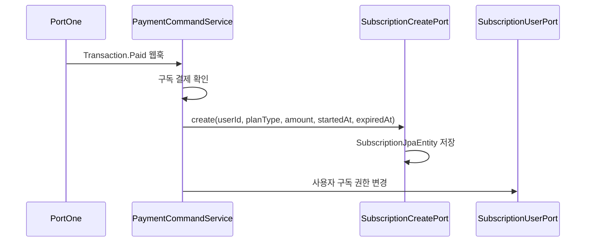

# 🔔 구독 API Flow

> 이 문서는 구독 조회 API(`SubscriptionController`)와 구독 생성·만료 처리 흐름을 설명합니다.
> 구독 결제 생성은 `PaymentController`의 책임이며, 구독은 결제 웹훅 처리 시 자동으로 생성됩니다. 결제 흐름은 [payment/docs/API_FLOW.md](../../payment/docs/API_FLOW.md)를 참고합니다.

---

## 1. 각 구성요소가 담당하는 역할

| 구성요소 | 책임 |
| --- | --- |
| `SubscriptionController` | 요청값 검증, 인증 사용자 ID 추출, 조회 UseCase 전달 |
| `SubscriptionQueryService` | 구독 플랜 목록 조회, 내 활성 구독 조회 |
| `SubscriptionRepository` | 구독 상태 및 만료일 기준 조회 |
| `SubscriptionExpirationScheduler` | 만료된 구독을 주기적으로 EXPIRED 처리 |
| `SubscriptionExpirationBatchService` | 만료 구독 배치 처리 로직 |

- 구독 **생성**은 `SubscriptionController`가 아닌 결제 웹훅(`PaymentCommandService`)에서 처리됩니다. 구독 API는 **조회 전용**입니다.

---

## 2. 구독 플랜 목록 조회 흐름

```text
사용자
  → GET /api/subscriptions/plans
  → SubscriptionController
  → SubscriptionQueryService
  → SubscriptionPlanType enum에서 플랜 정보 조회 (DB 조회 없음)
  → SubscriptionPlansResponse(plans)
```

- 플랜 정보(타입, 가격)는 `SubscriptionPlanType` enum에 정의되어 있습니다. DB를 조회하지 않습니다.

---

## 3. 내 구독 조회 흐름

```text
사용자
  → GET /api/subscriptions/me
  → SubscriptionController
  → SubscriptionQueryService
  → SubscriptionRepository.findActiveByUserId(userId, now)
      조건: status = ACTIVE AND expired_at > now
  → 결과가 없으면 null 반환
  → SubscriptionMeResponse 또는 null
```

---

## 4. 구독 생성 흐름 (결제 웹훅 연동)

구독은 직접 생성 API 없이 결제 웹훅 처리 과정에서 생성됩니다.



---

## 5. 구독 만료 처리 흐름

```text
SubscriptionExpirationScheduler (주기적 실행)
  → SubscriptionExpirationBatchService
  → SubscriptionRepository.findExpired(now)
      조건: status = ACTIVE AND expired_at <= now
  → 각 구독 EXPIRED 처리
  → 배치 결과 로그 기록
```

---

## 6. 타 도메인 개발자 체크포인트 ✅

1. 구독 생성 로직은 `payments/payment` bc의 `PaymentCommandService`에 있습니다. 구독 생성 조건이 변경되면 해당 서비스를 확인합니다.
2. 구독 활성 여부를 다른 bc에서 조회해야 한다면 `SubscriptionQueryPort`를 통해 payments/subscription bc에 위임합니다.
3. 사용자 권한 부여는 `SubscriptionUserPort`를 통해 user bc에 위임합니다.

---

## 📝 문서 정보

- 작성일: `2026-07-21`
