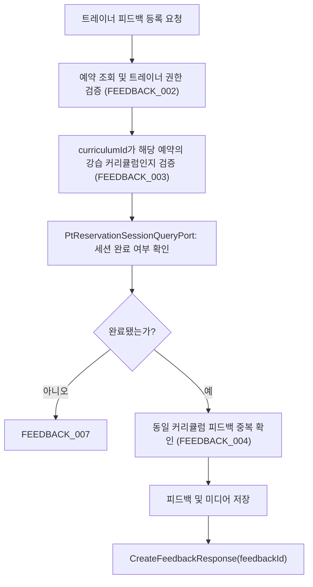

# 📝 피드백 API Flow

> 이 문서는 피드백 등록·수정·삭제·조회 API의 내부 흐름을 설명합니다.
> 세션 완료 여부 판단은 ptReservation bc에 위임합니다.

---

## 1. FeedbackService가 담당하는 역할

| 구성요소 | 책임 |
| --- | --- |
| `FeedbackController` | 요청값 검증, 인증 사용자 ID 추출, Command/Query UseCase 전달 |
| `FeedbackCommandService` | 피드백 등록·수정·삭제 처리 |
| `FeedbackQueryService` | 피드백 목록·상세 조회 |
| `PtReservationSessionQueryPort` | ptReservation bc에서 세션 완료 여부 조회 |

---

## 2. 피드백 목록·상세 조회 흐름

```text
트레이너 또는 수강생
  → GET /api/reservations/{reservationId}/feedbacks
  → FeedbackQueryService
  → FeedbackRepository.findByPtReservationId(reservationId)
  → FeedbackListResponse (피드백 없는 회차는 feedbacks: null)
```

```text
트레이너 또는 수강생
  → GET /api/reservations/{reservationId}/feedbacks/{feedbackId}
  → FeedbackQueryService
  → FeedbackRepository.findById(feedbackId)
  → FeedbackDetailResponse
```

---

## 3. 피드백 등록 흐름



### 단계별 설명

1. `ptReservationId`로 예약을 조회하고, 트레이너 본인 강습의 예약인지 검증합니다.
2. `curriculumId`가 해당 예약의 PT 강습 커리큘럼인지 검증합니다.
3. `PtReservationSessionQueryPort`로 세션 완료 여부를 확인합니다. 완료되지 않은 세션이면 `FEEDBACK_007`을 반환합니다.
4. 동일 커리큘럼에 이미 피드백이 있으면 `FEEDBACK_004`를 반환합니다.
5. 피드백과 미디어(BEFORE/AFTER)를 저장합니다.

---

## 4. 피드백 수정 흐름

```text
트레이너
  → PATCH /api/reservations/{reservationId}/feedbacks/{feedbackId}
  → FeedbackCommandService
      1. 피드백 조회
      2. 작성자(트레이너)가 본인인지 검증 (FEEDBACK_002)
      3. 기존 미디어 전부 삭제 후 새 미디어 저장
      4. content 수정
  → UpdateFeedbackResponse(feedbackId)
```

---

## 5. 피드백 삭제 흐름

```text
트레이너
  → DELETE /api/reservations/{reservationId}/feedbacks/{feedbackId}
  → FeedbackCommandService
      1. 피드백 조회
      2. 작성자(트레이너)가 본인인지 검증 (FEEDBACK_002)
      3. 예약의 DB 상태가 COMPLETED이면 삭제 불가 (FEEDBACK_006)
      4. soft delete 처리
```

---

## 6. 타 도메인 개발자 체크포인트 ✅

1. 피드백 등록 시 세션 완료 여부는 `PtReservationSessionQueryPort`를 통해 ptReservation bc에 위임합니다. 세션 완료 판단 기준이 변경되면 해당 포트 구현체를 함께 확인합니다.
2. 피드백 ID는 PT 예약 상세 조회(`GET /api/reservations/me/{reservationId}`) 응답의 각 커리큘럼 항목에 포함됩니다. 피드백 삭제·수정 시 이 연결 관계를 유지해야 합니다.
3. 피드백 신고(`targetType: FEEDBACK`)는 report bc의 `FeedbackReportTargetPort`를 통해 처리됩니다. 피드백 조회 방식이 변경되면 해당 어댑터를 함께 확인합니다.

---

## 📝 문서 정보

- 작성일: `2026-07-21`
