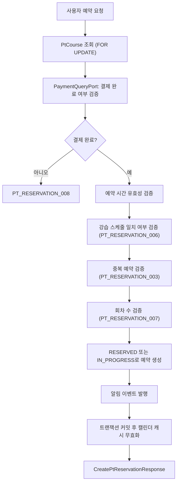

# 📅 PT 예약 API Flow

> 이 문서는 PT 예약 생성·상태변경·취소·세션 조회 API의 내부 흐름을 설명합니다.
> 예약 취소 시 캘린더 캐시 무효화는 트랜잭션 커밋 후 수행됩니다.

---

## 1. PtReservationService가 담당하는 역할

| 구성요소 | 책임 |
| --- | --- |
| `PtReservationController` | 요청값 검증, 인증 사용자 ID 추출, Command/Query UseCase 전달 |
| `PtReservationCommandService` | 예약 생성·상태변경·취소 처리 |
| `PtReservationQueryService` | 예약 목록·상세·세션 목록 조회 |
| `TrainerQueryPort` | trainer bc에서 트레이너 프로필 ID 및 userId 조회 |
| `PaymentQueryPort` | payments bc에서 PT 결제 완료 여부 조회 |
| `CalendarCacheEvictionPort` | calendar bc에서 캐시 무효화 요청 |

---

## 2. PT 예약 생성 흐름



### 단계별 설명

1. `PtCourse`를 `FOR UPDATE`로 조회해 동시 예약 요청을 직렬화합니다.
2. `PaymentQueryPort`로 결제 완료 여부를 확인합니다. 미결제 시 `PT_RESERVATION_008`을 반환합니다.
3. 완료된 세션이 1개 이상이면 `IN_PROGRESS`, 아니면 `RESERVED` 상태로 생성합니다.
4. 저장 후 수강생·트레이너에게 알림 이벤트를 발행합니다.
5. 캘린더 캐시 무효화는 트랜잭션 커밋 이후에 실행합니다.

---

## 3. 예약 목록·상세 조회 흐름

```text
사용자
  → GET /api/reservations/me?status=
  → PtReservationQueryService
  → PtReservationRepository.findByUserId(userId, status)
  → MyPtReservationsResponse
```

```text
사용자
  → GET /api/reservations/me/{reservationId}
  → PtReservationQueryService
      1. 예약 조회 및 본인 소유 검증
      2. PT 강습 커리큘럼 목록 조회
      3. 각 커리큘럼에 연결된 피드백 ID 조회
  → MyPtReservationDetailResponse (ptCourseId 포함)
```

> ✅ 응답의 `ptCourseId`는 프론트엔드가 강사평 작성 엔드포인트(`POST /api/pt-courses/{ptCourseId}/reservations/{ptReservationId}/reviews`) 호출 시 path variable로 사용합니다.

---

## 4. 예약 상태 변경 흐름 (트레이너)

```text
트레이너
  → PATCH /api/reservations/{reservationId}/status
  → PtReservationCommandService
      1. 예약 조회
      2. TrainerQueryPort로 트레이너 프로필 ID 조회 (트레이너만 접근 가능)
      3. 본인 강습의 예약인지 검증
      4. COMPLETED 요청 → 해당 수강생의 동일 PT 코스 전 세션 일괄 완료 처리
         기타 → 단건 상태 변경 (RESERVED 직접 설정 불가)
      5. 취소 시 알림 이벤트 발행
      6. 트랜잭션 커밋 후 캘린더 캐시 무효화
  → ChangePtReservationStatusResponse(status, progressCount, totalSessionCount)
```

---

## 5. PT 예약 취소 흐름 (수강생)

```text
수강생
  → PATCH /api/reservations/me/{reservationId}/cancel
  → PtReservationCommandService
      1. 예약 조회 및 본인 소유 검증
      2. 동일 PT 코스의 COMPLETED 제외 전 세션 일괄 CANCELLED 처리
      3. 취소 알림 이벤트 발행
      4. 트랜잭션 커밋 후 캘린더 캐시 무효화
  → CancelPtReservationResponse(sessionStatus: CANCELLED, cancelledAt)
```

---

## 6. PT 세션 목록·개별 취소 흐름

```text
수강생
  → GET /api/reservations/me/sessions
  → PtReservationQueryService
  → sessionStatus 도출: DB 상태 COMPLETED 또는 reservedEndAt < now → COMPLETED, 나머지는 DB 상태 그대로
  → PtSessionsResponse
```

```text
수강생
  → PATCH /api/reservations/me/sessions/{reservationId}/cancel
  → PtReservationCommandService
      1. 예약 조회 및 본인 소유 검증
      2. CANCELLED/COMPLETED 상태이면 예외 (PT_RESERVATION_005)
      3. 단건 CANCELLED 처리
      4. 취소 알림 이벤트 발행
      5. 트랜잭션 커밋 후 캘린더 캐시 무효화
  → CancelPtReservationResponse(sessionStatus: CANCELLED, cancelledAt)
```

---

## 7. sessionStatus와 PtReservationStatus의 차이 🔎

| 구분 | 설명 |
| --- | --- |
| `PtReservationStatus` | DB에 저장되는 실제 상태입니다. `RESERVED` / `IN_PROGRESS` / `COMPLETED` / `CANCELLED` 중 하나입니다. |
| `sessionStatus` (응답 필드) | 클라이언트에 노출되는 파생 상태입니다. DB가 `COMPLETED`이거나 `reservedEndAt < now`이면 `COMPLETED`, 그 외는 DB 상태 그대로 반환합니다. |

- 세션 취소 가능 여부 판단은 `PtReservationStatus` 기준입니다.
- 세션 목록 표시는 파생 `sessionStatus` 기준입니다.

---

## 8. 타 도메인 개발자 체크포인트 ✅

1. 예약 생성 시 `PaymentQueryPort`를 통해 payments bc에서 결제 완료 여부를 확인합니다. 결제 상태 기준이 변경되면 `PtReservationPaymentQueryAdapter`를 함께 확인합니다.
2. 트레이너 권한 검증은 `TrainerQueryPort`를 통해 trainer bc에 위임합니다.
3. 예약 생성·취소·상태변경 후 캘린더 캐시 무효화는 트랜잭션 커밋 후에 실행됩니다. `CalendarCacheEvictionPort` 구현 변경 시 이 타이밍을 유지해야 합니다.

---

## 📝 문서 정보

- 작성일: `2026-07-21`
