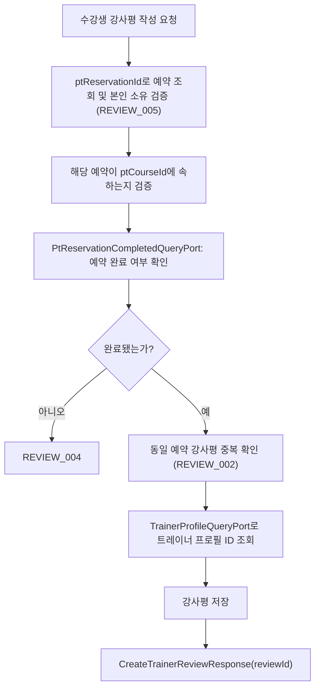

# ⭐ 강사평 API Flow

> 이 문서는 강사평 작성·수정·삭제·조회 API의 내부 흐름을 설명합니다.
> 강사평 작성 전 예약 완료 여부 검증은 ptReservation bc에 위임합니다.

---

## 1. TrainerReviewService가 담당하는 역할

| 구성요소 | 책임 |
| --- | --- |
| `TrainerReviewController` | 요청값 검증, 인증 사용자 ID 추출, Command/Query UseCase 전달 |
| `TrainerReviewCommandService` | 강사평 작성·수정·삭제 처리 |
| `TrainerReviewQueryService` | 강사평 요약·목록 조회 |
| `TrainerProfileQueryPort` | trainer bc에서 트레이너 프로필 ID 및 정보 조회 |
| `PtReservationCompletedQueryPort` | ptReservation bc에서 해당 PT 예약 완료 여부 조회 |
| `UserNicknameQueryPort` | user bc에서 작성자 닉네임 조회 |

---

## 2. 강사평 작성 흐름



### 단계별 설명

1. `ptReservationId`로 예약을 조회하고, 수강생 본인 소유인지 검증합니다.
2. 해당 예약이 요청 `ptCourseId`에 속하는지 검증합니다.
3. `PtReservationCompletedQueryPort`로 예약 완료 여부를 확인합니다. 미완료이면 `REVIEW_004`를 반환합니다.
4. 동일 `ptReservationId`에 이미 강사평이 있으면 `REVIEW_002`를 반환합니다.
5. `TrainerProfileQueryPort`로 트레이너 프로필 ID를 조회하고 강사평을 저장합니다.

> ✅ 강사평 작성 시 path variable인 `ptCourseId`는 PT 예약 상세 조회(`GET /api/reservations/me/{reservationId}`) 응답의 `ptCourseId`를 사용합니다.

---

## 3. 강사평 수정 흐름

```text
수강생
  → PATCH /api/reviews/{reviewId}
  → TrainerReviewCommandService
      1. 강사평 조회
      2. 작성자(수강생)가 본인인지 검증 (REVIEW_003)
      3. rating, content 수정
  → UpdateTrainerReviewResponse(reviewId)
```

---

## 4. 강사평 삭제 흐름

```text
수강생
  → DELETE /api/reviews/{reviewId}
  → TrainerReviewCommandService
      1. 강사평 조회
      2. 작성자(수강생)가 본인인지 검증 (REVIEW_003)
      3. soft delete 처리
```

---

## 5. 강사평 요약 조회 흐름

```text
사용자
  → GET /api/trainer-profiles/{trainerProfileId}/reviews/summary
  → TrainerReviewQueryService
      1. TrainerProfileQueryPort로 트레이너 이름·소개 조회
      2. TrainerReviewRepository에서 평균 별점, 총 강사평 수, 별점별 분포 집계
  → TrainerReviewSummaryResponse
```

---

## 6. 강사평 목록 조회 흐름 (커서 기반 페이지네이션)

```text
사용자
  → GET /api/trainer-profiles/{trainerProfileId}/reviews?cursor=&cursorRating=&size=10&sort=LATEST
  → TrainerReviewQueryService
  → 정렬 기준에 따른 커서 조건 적용
      [LATEST]      → createdAt 기준 내림차순, cursor = trainerReviewId
      [HIGH_RATING] → rating 내림차순 → createdAt 내림차순, cursor = trainerReviewId + cursorRating = rating
  → UserNicknameQueryPort로 작성자 닉네임 일괄 조회 (user bc)
  → TrainerReviewListResponse(reviews, nextCursor, nextCursorRating, hasNext)
```

- `nextCursorRating`은 `LATEST` 정렬 시 항상 `null`입니다.
- `hasNext`는 `size+1`개를 조회한 뒤 초과 여부로 판단하고 실제 응답은 `size`개만 반환합니다.

---

## 7. 타 도메인 개발자 체크포인트 ✅

1. 강사평 작성 전 예약 완료 여부 검증은 `PtReservationCompletedQueryPort`를 통해 ptReservation bc에 위임합니다. 예약 완료 판단 기준이 변경되면 해당 포트 구현체를 함께 확인합니다.
2. 목록 조회 시 작성자 닉네임은 `UserNicknameQueryPort`를 통해 user bc에서 일괄 조회합니다. 닉네임 조회 방식이 변경되면 해당 포트 구현체를 함께 확인합니다.
3. 강사평 요약(`averageRating`, `reviewCount`)은 PT 강습 상세 조회에도 노출됩니다. `ReviewQueryPort` 구현 변경 시 ptCourse bc의 상세 조회 응답도 함께 확인합니다.
4. 강사평 신고(`targetType: TRAINER_REVIEW`)는 report bc의 `TrainerReviewReportTargetPort`를 통해 처리됩니다. 강사평 조회 방식이 변경되면 해당 어댑터를 함께 확인합니다.

---

## 📝 문서 정보

- 작성일: `2026-07-21`
