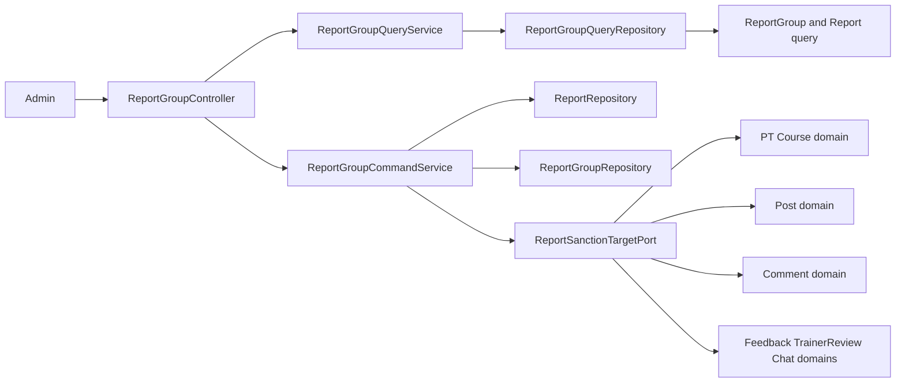
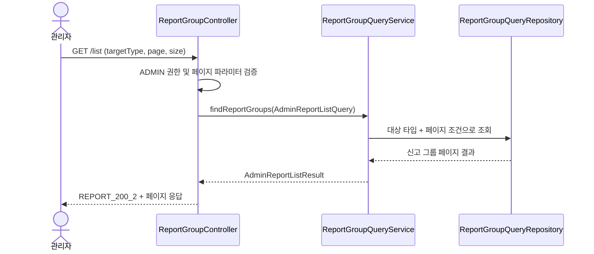
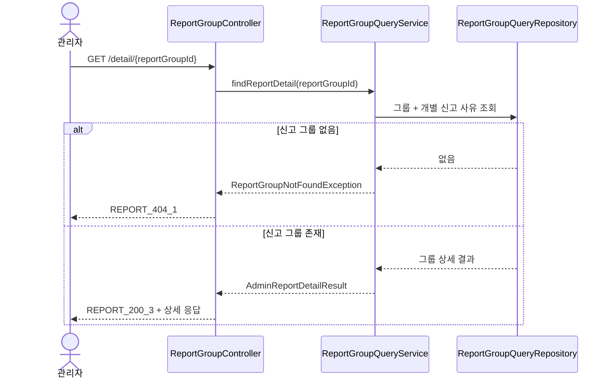
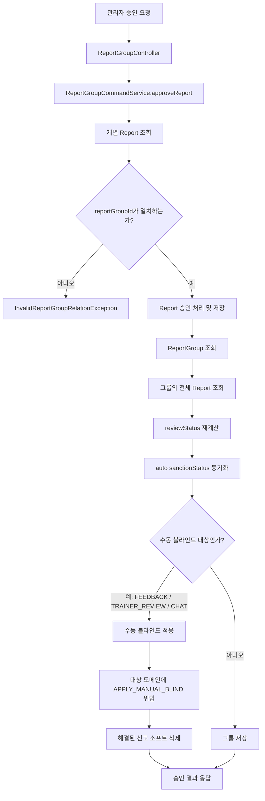
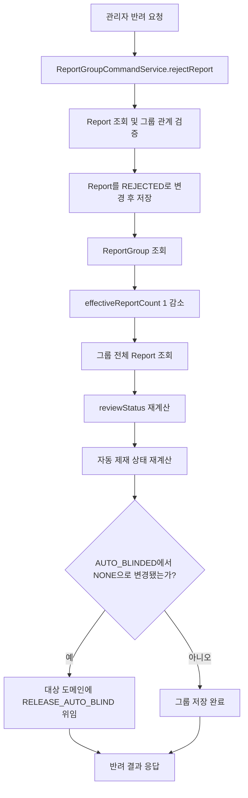
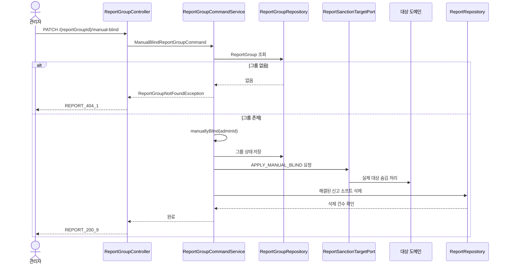
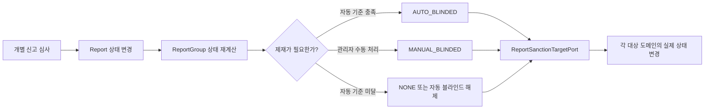

# 🚨 ReportGroup API Flow

> 이 문서는 관리자용 `ReportGroupController` API의 처리 흐름과 타 도메인 연동 지점을 설명합니다.  
> **신규 신고 접수 API는 `ReportController`의 책임**이며, 본 문서는 신고가 그룹으로 묶인 뒤의 조회·심사·제재 처리만 다룹니다.

---

## 1. ReportGroup이 담당하는 역할

`ReportGroup`은 같은 신고 대상(`targetType`, `targetId`)을 향한 여러 `Report`를 하나로 묶는 **루트 Aggregate**입니다.

- 개별 `Report`는 신고자, 신고 사유, 개별 심사 상태를 가집니다.
- `ReportGroup`은 누적 신고 수, 유효 신고 수, 그룹 심사 상태, 제재 상태를 관리합니다.
- 관리자는 그룹 목록과 상세를 조회하고, 개별 신고를 승인/반려하거나 그룹을 수동 블라인드할 수 있습니다.
- 실제 대상(PT 코스, 게시글, 댓글 등)의 숨김·복구는 `ReportSanctionTargetPort`를 통해 각 도메인에 위임합니다.



---

## 2. 공통 접근 제어와 상태 규칙

### 🔐 접근 제어

모든 API는 관리자만 호출할 수 있습니다.

1. `SecurityConfig`의 `/api/reportgroup/**` URL 권한 규칙에서 `ADMIN` 권한을 확인합니다.
2. `ReportGroupController`의 `@PreAuthorize("hasAuthority('ADMIN')")`가 다시 권한을 확인합니다.

따라서 일반 사용자는 신고 그룹 목록 조회, 심사, 수동 블라인드에 접근할 수 없습니다.

### 🧭 상태 규칙

| 구분 | 상태 | 의미 |
| --- | --- | --- |
| 개별 신고 `Report` | `PENDING` | 아직 심사되지 않은 신고 |
|  | `APPROVED` | 신고가 유효하다고 승인됨 |
|  | `REJECTED` | 신고가 반려됨 |
| 신고 그룹 `ReportGroup.reviewStatus` | `PENDING` | 그룹 안에 심사 대기 신고가 하나 이상 존재 |
|  | `RESOLVED` | 대기 신고가 없고, 승인 신고가 하나 이상 존재 |
|  | `REJECTED` | 대기 신고와 승인 신고가 모두 없음 |
| 제재 상태 `ReportGroup.sanctionStatus` | `NONE` | 제재 없음 |
|  | `AUTO_BLINDED` | 자동 블라인드 기준을 충족해 숨김 처리됨 |
|  | `MANUAL_BLINDED` | 관리자가 수동 블라인드 처리함 |

#### 자동 블라인드 기준

- 대상 타입이 `PT_COURSE`, `POST`, `COMMENT`인 경우에만 자동 블라인드 대상입니다.
- 유효 신고 수(`effectiveReportCount`)가 **5건 이상**이면 `AUTO_BLINDED`가 됩니다.
- 반려로 유효 신고 수가 감소해 기준 미만이 되면 자동 블라인드를 해제(`RELEASE_AUTO_BLIND`)합니다.
- 수동 블라인드(`MANUAL_BLINDED`)는 자동 상태 계산으로 덮어쓰지 않습니다.

---

## 3. API 한눈에 보기

| API | 목적 | 주요 결과 |
| --- | --- | --- |
| `GET /api/reportgroup/list` | 신고 그룹 목록 조회 | 대상 타입별 신고 그룹을 페이지 단위로 조회 |
| `GET /api/reportgroup/detail/{reportGroupId}` | 신고 그룹 상세 조회 | 그룹 정보와 개별 신고 사유·심사 상태 조회 |
| `PATCH /api/reportgroup/{reportGroupId}/reports/{reportId}/approve` | 개별 신고 승인 | 그룹 상태 재계산 및 필요 시 대상 제재 |
| `PATCH /api/reportgroup/{reportGroupId}/reports/{reportId}/reject` | 개별 신고 반려 | 유효 신고 수 감소, 그룹·제재 상태 재계산 |
| `PATCH /api/reportgroup/{reportGroupId}/manual-blind` | 그룹 수동 블라인드 | 대상 숨김 및 해결된 신고 소프트 삭제 |

---

## 4. 조회 API Flow

### 4.1 신고 그룹 목록 조회

`GET /api/reportgroup/list?targetType={targetType}&page=0&size=10`

관리자가 특정 신고 대상 타입의 그룹을 페이지 단위로 확인하는 API입니다.



처리 순서:

1. 컨트롤러가 `targetType`, `page`, `size`를 받아 `AdminReportListQuery`로 변환합니다.
2. `page`는 `0` 이상, `size`는 `1~100` 범위로 검증됩니다.
3. `ReportGroupQueryService`가 조회 포트에 위임합니다.
4. 조회 어댑터가 대상 타입으로 필터링한 그룹 목록과 페이징 정보를 반환합니다.
5. 컨트롤러가 `AdminReportListResponse`로 변환해 응답합니다.

타 도메인 관점:

- 목록 조회는 신고 도메인의 읽기 모델만 사용합니다.
- 대상 원본(게시글 본문, PT 코스 상세 등)을 다시 조회하지 않으므로, 목록에는 신고 접수 시점에 저장된 대상 스냅샷 정보가 사용될 수 있습니다.

### 4.2 신고 그룹 상세 조회

`GET /api/reportgroup/detail/{reportGroupId}`

관리자가 하나의 신고 그룹과 그 안의 개별 신고 내역을 확인하는 API입니다.



상세 화면에서 주로 확인하는 정보:

- 신고 대상 타입과 대상 ID
- 대상 제목·내용·파일 스냅샷
- 총 신고 수, 유효 신고 수
- 그룹 심사 상태와 제재 상태
- 개별 신고자의 신고 사유, 심사 상태, 심사 처리자 및 처리 시각

> ✅ 승인·반려 응답의 `reportId`는 `report.getReportId()`로 매핑됩니다. 신고자 이름 조회에만 `report.getReporterId()`를 사용합니다.

---

## 5. 개별 신고 심사 API Flow

### 5.1 신고 승인

`PATCH /api/reportgroup/{reportGroupId}/reports/{reportId}/approve`

개별 신고를 승인한 뒤, 같은 그룹 전체의 심사 상태와 제재 상태를 다시 계산합니다.



처리 순서:

1. `Report`를 조회합니다. 없으면 `ReportNotFoundException`이 발생합니다.
2. 조회한 신고가 URL의 `reportGroupId`에 속하는지 검증합니다. 다른 그룹의 신고를 조작하는 요청을 차단합니다.
3. 이미 승인·반려된 신고인지 확인한 뒤, 신고 상태를 `APPROVED`로 변경하고 관리자 ID와 처리 시각을 저장합니다.
4. 신고 그룹과 그룹에 속한 전체 신고를 조회합니다.
5. 전체 신고 상태를 기준으로 그룹의 `reviewStatus`를 재계산합니다.
6. 자동 블라인드 대상이면 유효 신고 수 기준으로 `sanctionStatus`를 동기화합니다.
7. `FEEDBACK`, `TRAINER_REVIEW`, `CHAT`은 승인 시 수동 블라인드 정책을 적용합니다.
8. 제재가 필요한 경우 `ReportSanctionTargetPort`를 통해 실제 대상 도메인에 숨김 처리를 요청합니다.
9. 처리 결과를 `REPORT_200_5`로 반환합니다.

### 5.2 신고 반려

`PATCH /api/reportgroup/{reportGroupId}/reports/{reportId}/reject`

개별 신고를 반려합니다. 반려된 신고는 유효 신고 수에서 제외되며, 자동 블라인드 상태가 해제될 수 있습니다.



처리 순서:

1. 승인 API와 동일하게 신고 존재 여부와 그룹 소속 관계를 먼저 검증합니다.
2. 신고 상태를 `REJECTED`로 변경하고 저장합니다.
3. 그룹의 `effectiveReportCount`를 1 감소시킵니다. 값이 음수가 되면 `EffectiveReportCountUnderflowException`으로 처리합니다.
4. 그룹의 전체 신고를 기준으로 `reviewStatus`와 자동 제재 상태를 다시 계산합니다.
5. 이전 상태가 `AUTO_BLINDED`이고 새 상태가 `NONE`이면 `RELEASE_AUTO_BLIND`를 대상 도메인에 전달합니다.
6. 처리 결과를 `REPORT_200_6`으로 반환합니다.

> 💡 `MANUAL_BLINDED` 상태는 반려 처리 후에도 자동 계산으로 해제되지 않습니다. 수동 제재의 해제 정책은 별도 API 또는 운영 정책으로 다뤄야 합니다.

---

## 6. 그룹 수동 블라인드 API Flow

`PATCH /api/reportgroup/{reportGroupId}/manual-blind`

신고 건수와 무관하게 관리자가 대상 콘텐츠를 즉시 숨김 처리하는 API입니다.



처리 순서:

1. 신고 그룹을 조회합니다.
2. `ReportGroup.manuallyBlind(adminId)`로 그룹 상태를 `RESOLVED`, 제재 상태를 `MANUAL_BLINDED`로 변경합니다.
3. 변경된 그룹을 저장합니다.
4. `ReportSanctionTargetPort`에 `APPLY_MANUAL_BLIND` 액션을 전달해 실제 대상 도메인의 숨김 처리를 수행합니다.
5. `softDeleteResolvedManualBlindedById(reportGroupId)`로 해결된 신고를 소프트 삭제합니다.
6. 소프트 삭제 건수가 정확히 1건이 아니면 `ReportSoftDeletionFailedException`으로 실패 처리합니다.

---

## 7. 타 도메인 연동 계약

신고 도메인은 대상 엔티티를 직접 수정하지 않습니다. `ReportSanctionTargetPort`가 도메인 간 경계입니다.

| 대상 타입 | 승인 후 자동 상태 계산 | 수동 블라인드 호출 | 자동 블라인드 해제 호출 | 대상 도메인이 구현해야 할 책임 |
| --- | --- | --- | --- | --- |
| `PT_COURSE` | O | O | O | 코스 숨김·복구 상태 변경 |
| `POST` | O | O | O | 게시글 숨김·복구 상태 변경 |
| `COMMENT` | O | O | O | 댓글 숨김·복구 상태 변경 |
| `FEEDBACK` | X | O | X | 수동 숨김 상태 변경 |
| `TRAINER_REVIEW` | X | O | X | 수동 숨김 상태 변경 |
| `CHAT` | X | O | X | 수동 숨김 상태 변경 |

연동 흐름은 아래 계약으로 통일됩니다.

```java
reportSanctionTargetPort.applySanction(
    reportGroup.getReportTargetType(),
    reportGroup.getTargetId(),
    sanctionAction
);
```

타 도메인 개발자가 확인할 사항:

1. 자신의 `ReportTargetType`에 대한 대상 ID 조회가 가능한지 확인합니다.
2. `APPLY_MANUAL_BLIND`, `RELEASE_AUTO_BLIND` 등 전달 가능한 제재 액션을 처리합니다.
3. 이미 숨김 또는 삭제된 대상을 재처리할 때의 멱등성 정책을 정합니다.
4. 대상 상태 변경 실패 시 예외가 신고 도메인 트랜잭션에 어떤 영향을 주는지 함께 검토합니다.

> ⚠️ 신고 도메인의 어댑터에 대상 타입 분기가 있어도, 실제 숨김·복구 동작은 각 대상 도메인의 Port 구현에 달려 있습니다. 신규 대상 타입을 추가할 때는 `ReportTargetQueryPort`와 `ReportSanctionTargetPort` 양쪽 연동을 함께 구현·검증해야 합니다.

---

## 8. 핵심 요약 🌟



- ✅ **심사는 개별 `Report` 단위**로 수행합니다.
- ✅ **상태와 제재 판단은 `ReportGroup` 단위**로 수행합니다.
- ✅ **대상 콘텐츠 변경은 Port를 통해 타 도메인에 위임**합니다.
- ✅ **승인/반려마다 그룹 전체 상태를 재계산**하므로, 여러 관리자가 순차 심사해도 최종 그룹 상태를 일관되게 유지합니다.
- ⚠️ 그룹 상태 재계산과 타 도메인 제재가 함께 일어나므로, 대상 도메인 연동 실패·멱등성·트랜잭션 경계를 반드시 함께 검토해야 합니다.

---

## 📝 문서 정보

- 업데이트일: `2026-07-21`
- 변경 사항(요약):
  - 승인·반려 응답의 `reportId` 매핑 오류를 해결해 개별 신고 ID를 반환하도록 최신화했습니다.
