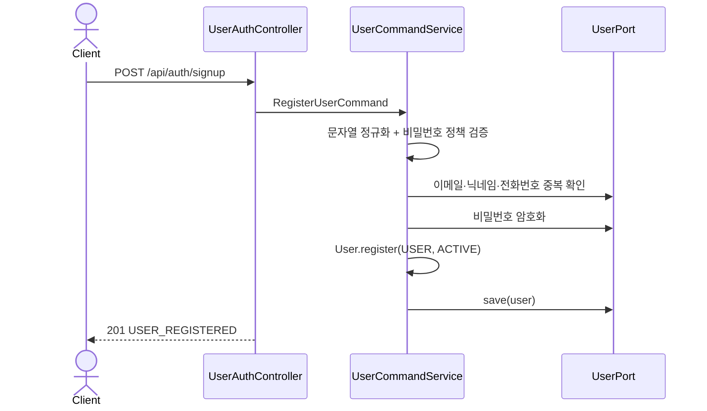
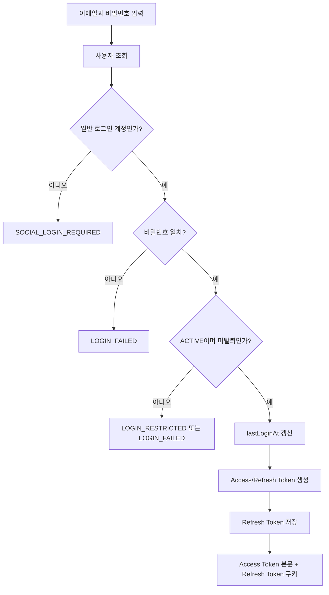
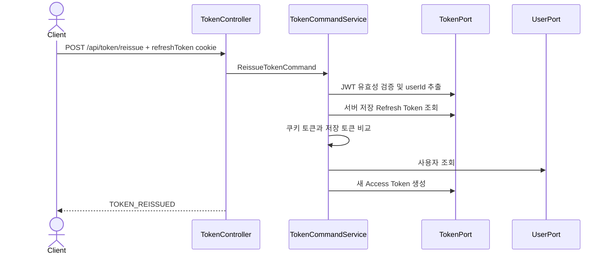

# 🔐 User Auth API Flow

> 회원가입, 일반·소셜 로그인, 로그아웃, 토큰 재발급과 임시 비밀번호 발급의 내부 흐름을 설명합니다.  
> 프로필과 관리자 회원 관리는 [USER_MANAGEMENT_API_FLOW.md](USER_MANAGEMENT_API_FLOW.md)를 참고합니다.

## 1. 책임 범위

| 구성요소 | 책임 |
| --- | --- |
| `UserAuthController` | 인증 관련 HTTP 요청·응답과 Refresh Token 쿠키 처리 |
| `TokenController` | Access Token 검증 응답 및 재발급 요청 전달 |
| `UserCommandService` | 회원가입, 로그인, 로그아웃, 소셜 추가 정보 처리 |
| `OAuth2LoginService` | OAuth2 공급자 정보 변환, 소셜 회원 조회·생성 및 토큰 발급 |
| `TokenCommandService` | Refresh Token 검증과 Access Token 재발급 |
| `MailService` | 임시 비밀번호 생성·저장·메일 발송 |
| `UserPort` | 사용자 조회·저장, 비밀번호 암호화·비교 |
| `TokenPort` | JWT 생성·검증과 Refresh Token 저장·삭제 |

## 2. 일반 회원가입

- 신규 일반 사용자의 역할은 `USER`, 상태는 `ACTIVE`입니다.
- `onboardingCompleted`와 `paid`는 모두 `false`로 시작합니다.
- 중복 검증 후 비밀번호를 암호화하여 저장합니다.

## 3. 일반 로그인과 로그아웃

### 로그인

`User.validateLoginAllowed()`는 탈퇴 회원과 정지 회원의 로그인을 차단합니다. 로그인 성공 시 기존 Refresh Token은 사용자 ID 기준으로 저장 또는 교체됩니다.

### 로그아웃

1. 인증 사용자 ID를 확인합니다.
2. 서버에 저장된 Refresh Token을 삭제합니다.
3. 컨트롤러가 Access/Refresh Token 쿠키의 `maxAge`를 0으로 설정합니다.

## 4. 토큰 검증과 재발급

`GET /api/token/validate`는 보안 필터를 통과했다는 사실 자체로 Access Token의 유효성을 확인합니다.

재발급 흐름:

Refresh Token은 회전시키지 않고 기존 토큰을 검증한 뒤 Access Token만 새로 발급합니다.

## 5. 소셜 로그인

1. OAuth2 공급자 응답을 `OAuth2UserInfoFactory`가 공통 사용자 정보로 변환합니다.
2. `socialProvider + socialId`로 기존 사용자를 조회하고, 없으면 소셜 사용자를 생성합니다.
3. 계정의 로그인 가능 상태를 확인하고 `lastLoginAt`을 갱신합니다.
4. Access/Refresh Token을 발급하고 Refresh Token을 저장합니다.
5. 닉네임과 전화번호가 아직 없으면 `onboardingCompleted`가 완료되지 않은 상태로 후속 입력을 유도합니다.
6. `PATCH /api/auth/social/complete`가 닉네임·전화번호를 검증하고 저장합니다.

지원 공급자는 `GOOGLE`, `KAKAO`, `NAVER`입니다.

## 6. 임시 비밀번호

`POST /api/auth/password`는 이메일 형식을 검증한 뒤 사용자를 조회하고, 임시 비밀번호를 발급해 암호화 저장한 다음 `MailPort`를 통해 메일을 보냅니다. 사용자가 없거나 계정이 사용 불가능한 상태이면 사용자 도메인 예외가 발생할 수 있으며, 메일 전송 실패는 `MailSendException`으로 변환됩니다.

## 7. 보안 체크포인트

- `/api/auth/signup`, `/api/auth/login`, `/api/auth/password`, `/api/auth/social/complete`는 URL 규칙상 `/api/auth/**` 허용 범위지만, 소셜 추가 정보 API는 컨트롤러에서 인증 주체를 직접 확인합니다.
- `/api/auth/logout`은 SecurityConfig에서 먼저 `authenticated()`가 적용됩니다.
- `/api/token/reissue`는 비인증 접근이 가능하고 Refresh Token으로 신원을 검증합니다.
- `/api/token/validate`는 인증이 필요합니다.
- Refresh Token은 응답 본문에 노출하지 않고 HttpOnly 쿠키로 전달합니다.

## 문서 정보

- 업데이트일: `2026-07-21`
- 현재 인증·토큰 서비스 구현을 기준으로 작성했습니다.
