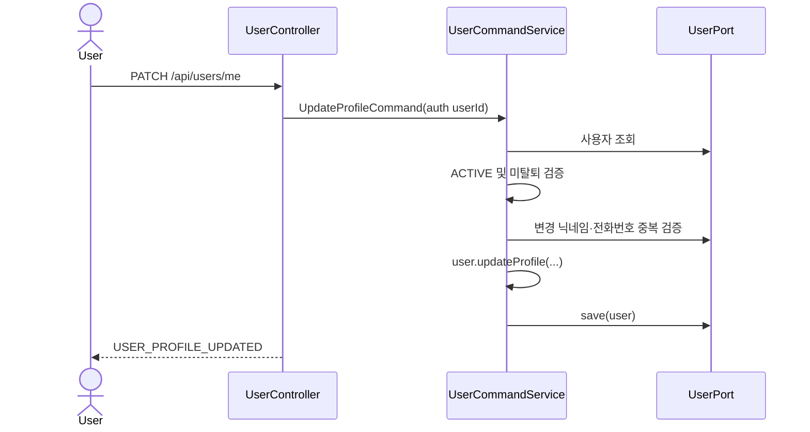
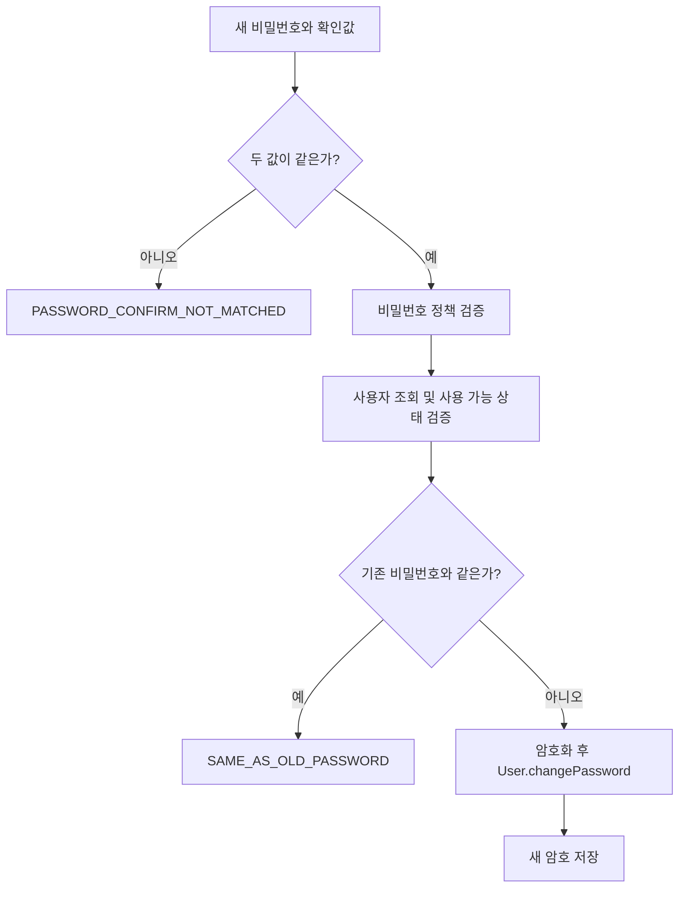
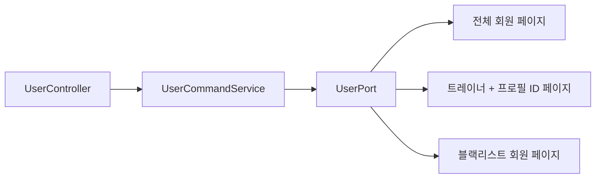
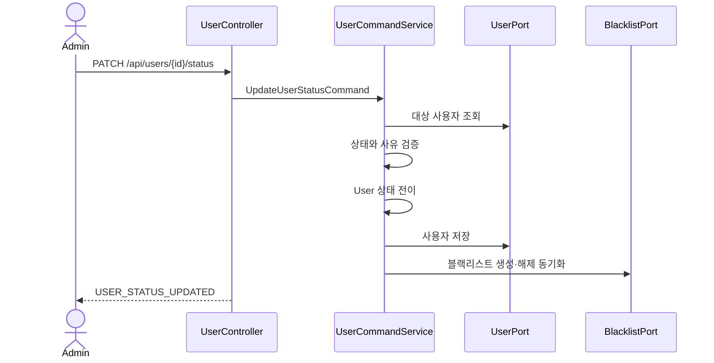

# 👤 User Management API Flow

> 인증 이후의 내 프로필 관리, 관리자 회원 조회·상태 변경, 정지 해제와 탈퇴 회원 보존 정책을 설명합니다.  
> 회원가입·로그인·토큰 흐름은 [USER_AUTH_API_FLOW.md](USER_AUTH_API_FLOW.md)를 참고합니다.

## 1. User 도메인의 역할

`User`는 사용자 식별 정보, 역할, 계정 상태, 온보딩·결제 상태와 탈퇴 여부를 관리하는 도메인 모델입니다.

| 구분 | 값 |
| --- | --- |
| 역할 | `USER`, `ADMIN`, `ORGANIZATION`, `TRAINER` |
| 상태 | `ACTIVE`, `DAY_7`, `ETERNAL`, `WITHDRAWN` |
| 소셜 공급자 | `GOOGLE`, `KAKAO`, `NAVER` |

실제 탈퇴 여부는 `deletedAt`으로 판단합니다. 즉, 탈퇴는 즉시 물리 삭제하지 않고 soft delete로 처리됩니다.

## 2. 접근 제어

- `/api/users/**`는 SecurityConfig에서 인증된 `ADMIN`, `USER`, `TRAINER`, `ORGANIZATION`에게 열려 있습니다.
- 관리자 목록과 상태 변경 API는 `@PreAuthorize("hasAuthority('ADMIN')")`로 한 번 더 제한합니다.
- 회원 탈퇴는 `USER`, `TRAINER`만 호출할 수 있습니다.
- 그 밖의 `/me` API는 인증 주체의 `userId`를 사용하므로 다른 사용자의 프로필을 직접 지정할 수 없습니다.

## 3. 내 프로필 조회·수정

- 조회 결과는 이름, 닉네임, 전화번호, 유료 구독 이용 여부입니다.
- 수정 시 이름·닉네임·전화번호가 모두 필요합니다.
- 자신의 기존 닉네임·전화번호를 그대로 쓰는 경우는 중복으로 간주하지 않으며, 다른 회원이 사용하는 값만 차단합니다.
- 프로필 수정 전 비밀번호 확인 API는 저장된 암호와 입력값을 비교합니다.

`GET /api/users/mypage`는 이메일, 닉네임, 소셜 회원 여부와 커뮤니티 게시글 수를 조합해 반환합니다. 게시글 수는 사용자 도메인 밖의 조회 경계를 통해 얻는 파생 정보입니다.

## 4. 비밀번호 변경

비밀번호는 8~16자이며 영문·숫자·특수문자를 각각 포함해야 합니다.

## 5. 회원 탈퇴

회원 탈퇴 요청은 다음 순서로 처리됩니다.

1. 인증 사용자 ID로 회원을 조회합니다.
2. 이미 탈퇴했는지 확인합니다.
3. 사용자 정보를 soft delete 상태로 변경합니다.
4. 저장된 인증 토큰과 사용자 관련 캐시를 정리합니다.
5. 탈퇴 보존 기간이 지난 계정은 `UserWithdrawnRetentionJob`과 `UserRetentionService`가 `DeleteWithdrawnUserPort`를 통해 정리합니다.

탈퇴 직후에는 로그인과 일반 프로필 기능을 사용할 수 없습니다. 물리 삭제 시점은 `UserRetentionProperties`의 보존 설정을 따릅니다.

## 6. 관리자 회원 목록

- `keyword`는 선택값이며 회원 검색에 사용됩니다.
- 기본 페이지는 `0`, 기본 크기는 `20`입니다.
- 트레이너 목록은 타 도메인의 트레이너 프로필 ID도 함께 반환합니다.
- 블랙리스트 목록은 회원 상태와 블랙리스트 유형·관리자 처리 사유를 함께 반환합니다.

## 7. 관리자 회원 상태 변경

`PATCH /api/users/{userId}/status`는 대상 회원과 처리 관리자 ID, 상태, 사유를 `UpdateUserStatusCommand`로 전달합니다.

| 요청 상태 | 도메인 처리 | 블랙리스트 처리 |
| --- | --- | --- |
| `ACTIVE` | 사용자 활성화 | 활성 제재 해제/종료 |
| `DAY_7` | 7일 정지 | 기간제 블랙리스트 기록 |
| `ETERNAL` | 영구 정지 | 영구 블랙리스트 기록 |
| `WITHDRAWN` | 허용하지 않음 | 해당 없음 |

정지 상태에서는 사유가 필수입니다. `ACTIVE`, `DAY_7`, `ETERNAL` 이외의 값은 `USER_400_9`로 거절됩니다.

## 8. 7일 정지 자동 해제

`UserSuspensionExpirationJob`이 주기적으로 만료된 정지를 찾고 `UserSuspensionExpirationService`에 해제를 요청합니다.

1. 만료된 활성 블랙리스트를 조회합니다.
2. 해당 사용자가 아직 `DAY_7` 상태이면 `ACTIVE`로 변경합니다.
3. 블랙리스트 상태를 종료 처리합니다.
4. 사용자가 없거나 이미 다른 상태라면 현재 상태를 존중하며 중복 전이를 피합니다.

영구 정지(`ETERNAL`)는 이 작업으로 자동 해제되지 않습니다.

## 9. 타 도메인 연동 지점

User 도메인은 내부 Adapter를 통해 다른 도메인에 다음 기능을 제공합니다.

- 온보딩 도메인의 사용자 조회·온보딩 완료 처리
- 트레이너 신청 도메인의 사용자 조회와 역할 변경
- 조직 계정 생성 및 생성 완료 메일 이벤트
- 로그인 ID 검증
- 다른 도메인이 사용할 사용자 기본 정보 조회
- 사용자 관련 캐시 제거와 탈퇴 회원 연관 데이터 정리

연동 시에는 데이터베이스 엔티티를 직접 공유하기보다 제공된 Port/Adapter 계약을 사용해야 사용자 상태와 soft delete 정책이 일관되게 적용됩니다.

## 문서 정보

- 업데이트일: `2026-07-21`
- 현재 프로필, 관리자 상태 관리, 정지 해제 및 탈퇴 보존 구현을 기준으로 작성했습니다.
